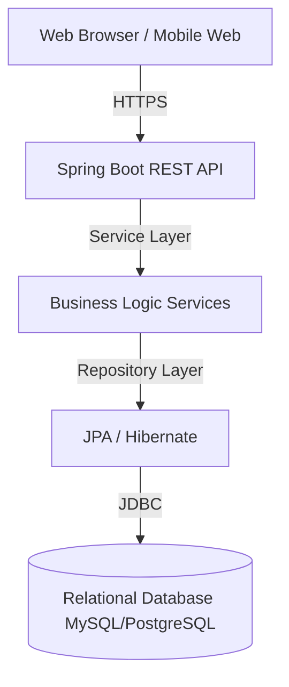

# Phase 3: High-Level Design (HLD)

## 1. Architecture Choice
**Modular Monolith** using **Spring Boot**.

### Reasoning
*   Single school scope (1k-5k students).
*   Clear domain boundaries.
*   Simpler deployment and maintenance compared to microservices.
*   Faster development cycle for MVP.
*   Easier to refactor into microservices later if needed.

## 2. System Components



## 3. Core Modules (Hashed to Packages)

| Module | Responsibility |
| :--- | :--- |
| **Auth** | Authentication (Login), RBAC, Session/Token Management |
| **User** | Common user entity, profile management |
| **Student** | Student interactions, profile, associations |
| **Teacher** | Teacher profile, assignments |
| **Academic** | Classes, Sections, Subjects management |
| **Attendance** | Daily attendance tracking logic |
| **Exam** | Exam scheduling, Marks entry, Rules |
| **Fees** | Fee heads, structures, student billing and payments |
| **Timetable** | Weekly schedule management and conflict checks |
| **Reporting** | Data aggregation and statistical services |

## 4. Data Flow Example

```
Request (POST /attendance/mark)
    ↓
Controller (AttendanceController) validates input
    ↓
Service (AttendanceService) checks business rules
(e.g., Is teacher assigned? Is date valid?)
    ↓
Repository (AttendanceRepository) saves to DB
    ↓
Database (INSERT INTO attendance ...)
```
