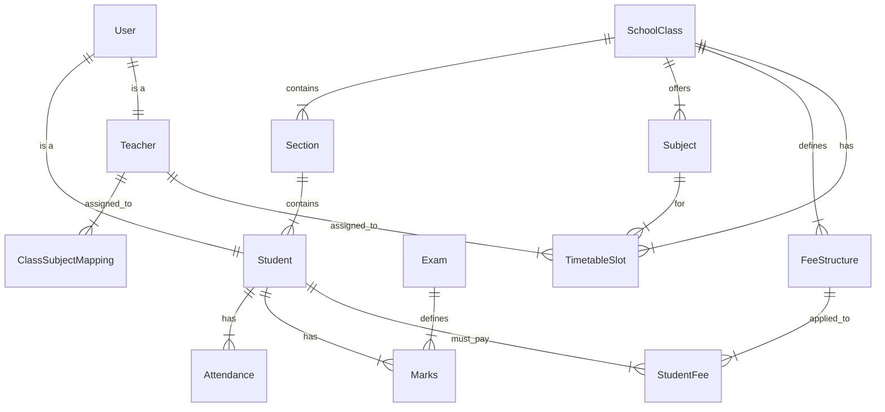

# Phase 5: Database Design (Enriched)

## 1. ER Diagram Overview

## 2. Table Definitions

### `users`
| Column | Type | Constraints |
| :--- | :--- | :--- |
| id | BIGINT | PK, Auto Inc |
| username | VARCHAR(50) | Unique, Not Null |
| password_hash | VARCHAR(255) | Not Null |
| role | ENUM | ('ADMIN', 'TEACHER', 'STUDENT') |
| status | ENUM | ('ACTIVE', 'INACTIVE') |
| created_at | TIMESTAMP | Default Current Timestamp |

### `students`
| Column | Type | Constraints |
| :--- | :--- | :--- |
| id | BIGINT | PK, Auto Inc |
| user_id | BIGINT | FK -> users.id, Unique |
| first_name | VARCHAR(100) | Not Null |
| last_name | VARCHAR(100) | |
| admission_no | VARCHAR(20) | Unique, Not Null |
| roll_no | INT | Not Null |
| class_id | BIGINT | FK -> classes.id |
| section_id | BIGINT | FK -> sections.id |
| dob | DATE | Not Null |
| gender | ENUM | ('M', 'F', 'O') |
| parent_contact | VARCHAR(15) | |

### `teachers`
| Column | Type | Constraints |
| :--- | :--- | :--- |
| id | BIGINT | PK, Auto Inc |
| user_id | BIGINT | FK -> users.id, Unique |
| name | VARCHAR(100) | Not Null |
| qualification | VARCHAR(100) | |
| email | VARCHAR(100) | |

### `classes`, `sections`, `subjects`
*   `classes`: `id`, `class_number` (Int, Unique), `academic_year`
*   `sections`: `id`, `name` (VARCHAR), `class_id` (FK)
*   `subjects`: `id`, `name` (VARCHAR)

### `attendance`
| Column | Type | Constraints |
| :--- | :--- | :--- |
| id | BIGINT | PK, Auto Inc |
| student_id | BIGINT | FK -> students.id |
| class_id | BIGINT | FK -> classes.id |
| section_id | BIGINT | FK -> sections.id |
| date | DATE | Not Null |
| status | ENUM | ('PRESENT', 'ABSENT', 'LEAVE') |
| marked_by | BIGINT | FK -> teachers.id |

### `exams`, `exam_schedules`, `marks`
*   `exams`: `id`, `name`, `start_date`, `end_date`, `is_published`
*   `exam_schedules`: `id`, `exam_id`, `class_id`, `subject_id`, `exam_date`, `max_marks`
*   `marks`: `id`, `exam_schedule_id`, `student_id`, `marks_obtained`, `remarks`

### `fee_heads` (New)
| Column | Type | Constraints |
| :--- | :--- | :--- |
| id | BIGINT | PK, Auto Inc |
| name | VARCHAR(50) | Not Null (e.g. Tuition, Bus, Sports) |
| description | VARCHAR(255) | |

### `fee_structures` (New)
| Column | Type | Constraints |
| :--- | :--- | :--- |
| id | BIGINT | PK, Auto Inc |
| class_id | BIGINT | FK -> classes.id |
| fee_head_id | BIGINT | FK -> fee_heads.id |
| amount | DECIMAL(10,2) | Not Null |
| academic_year | VARCHAR(10) | Not Null (e.g. "2024-25") |
| due_date | DATE | Not Null (Global due date for this fee) |

### `student_fees` (New - The Ledger)
| Column | Type | Constraints |
| :--- | :--- | :--- |
| id | BIGINT | PK, Auto Inc |
| student_id | BIGINT | FK -> students.id |
| fee_structure_id | BIGINT | FK -> fee_structures.id |
| status | ENUM | ('PENDING', 'PAID') |
| paid_date | DATE | Nullable |
| paid_amount | DECIMAL(10,2) | Nullable |
| transaction_ref | VARCHAR(50) | Nullable (Receipt No) |

### `timetable_slots` (New)
| Column | Type | Constraints |
| :--- | :--- | :--- |
| id | BIGINT | PK, Auto Inc |
| class_id | BIGINT | FK -> classes.id |
| section_id | BIGINT | FK -> sections.id |
| subject_id | BIGINT | FK -> subjects.id |
| teacher_id | BIGINT | FK -> teachers.id |
| day_of_week | ENUM | ('MONDAY', 'TUESDAY', 'WEDNESDAY', 'THURSDAY', 'FRIDAY', 'SATURDAY', 'SUNDAY') |
| start_time | TIME | Not Null |
| end_time | TIME | Not Null |

## 3. Indexes & Constraints
*   **Unique**: `students(admission_no)`
*   **Unique**: `fee_structures(class_id, fee_head_id, academic_year)` - No duplicate fees.
*   **Unique**: `student_fees(student_id, fee_structure_id)` - One record per fee per student.
